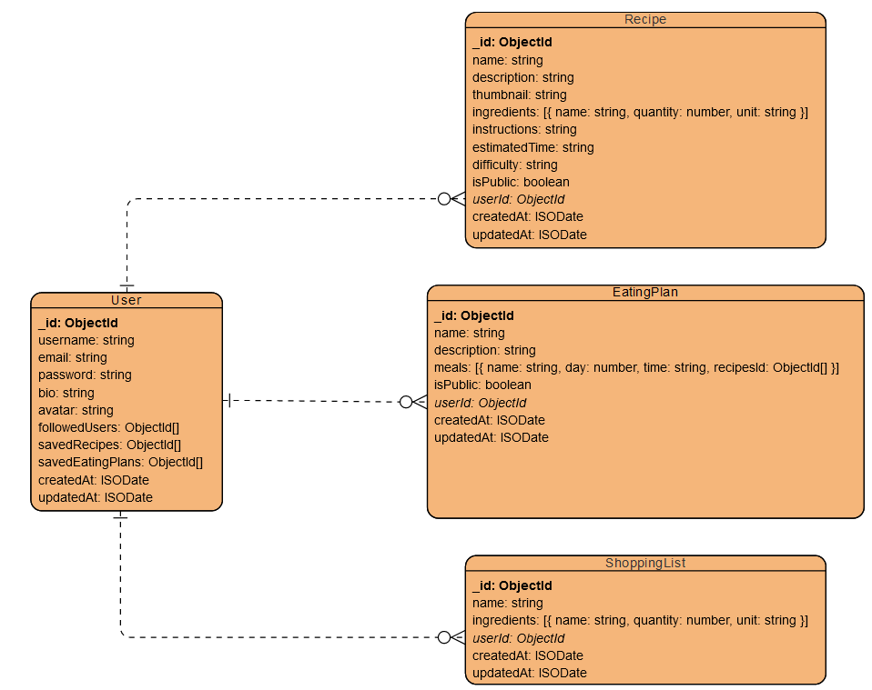

#Ogólny opis i wymagania
Aplikacja internetowa do tworzenia i dzielenia się przepisami oraz jadłospisami. Celem aplikacji było stworzenie platformy, która umożliwia dostęp do nich w jednym miejscu oraz ich łatwe wyszukiwanie. 

Można wyszukiwać autorów, których następnie można zaobserwować, by pozostać na bieżąco z ich twórczością. Ich twórczość pojawia się na stronie głównej osób obserwujących.

Można tworzyć również listy zakupów na podstawie wybranych przepisów lub jadłospisów oraz poprzez dodanie pojedynczych składników.

#Potrzeba rynkowa
W Internecie znajduje się wiele stron, blogów, kont na portalach społecznościowych o tematyce kulinarnej. Jednak przeglądanie ich może być niewygodne. Dlatego pojawił się pomysł, żeby dostarczyć platformę, przy użyciu, której użytkownicy mogliby dzielić się przepisami, w jednym miejscu, przy użyciu jednego interfejsu, co zwiększałoby wygodę i zasięg dodawanych przepisów, które byłyby dostępne dla większej liczby osób.

#Grupa docelowa
Osoby interesujące się gotowaniem, które chciałyby, żeby ich przepisy oraz ich ulubieni autorzy, a także ich listy zakupów znajdowały się w jednej aplikacji.

#Diagram ERD
